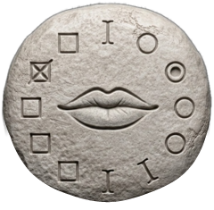
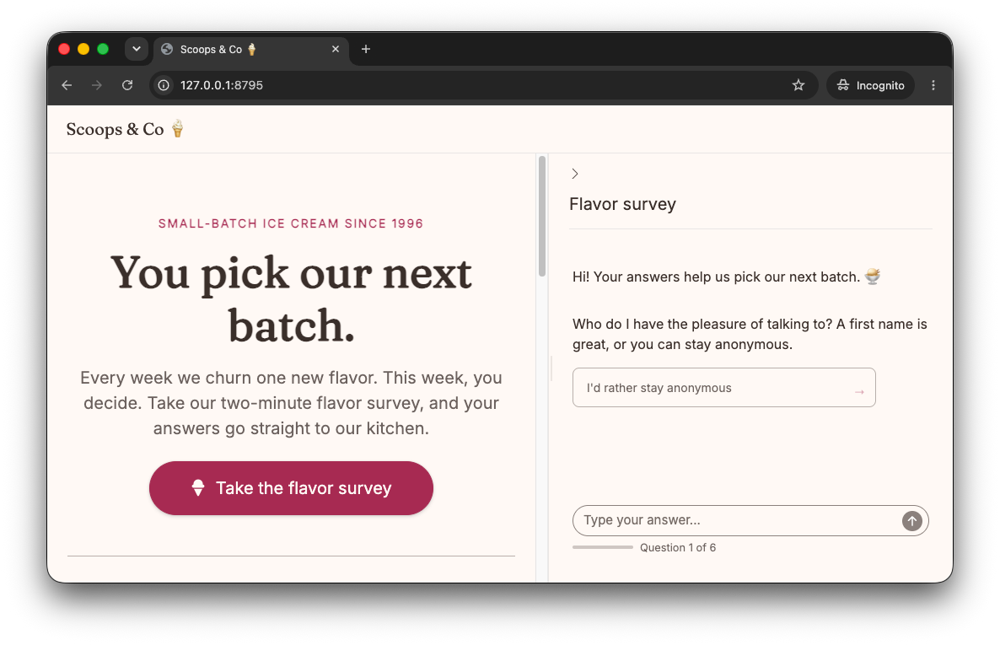
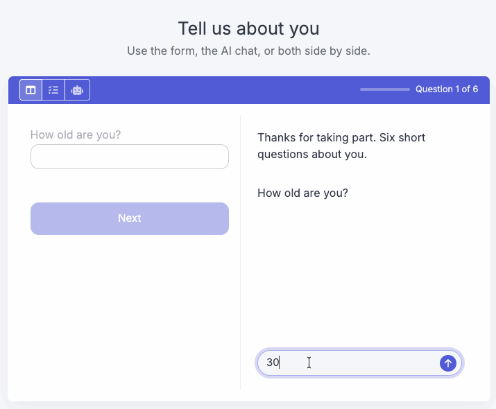

# surveychat <a href="https://dylanpieper.github.io/surveychat/"></a>

surveychat collects data in a conversation with [shinychat](https://posit-dev.github.io/shinychat/). The user answers structured questions in a natural dialogue. At the same time, the LLM extracts the data, generates content, and asks adaptive questions.

## Installation

``` r
pak::pak("dylanpieper/surveychat")
```

## Example 🍦✨

The package includes a demo: the web page of an ice cream shop with a flavor survey in a side panel. The survey asks about the favorites of the user, and a drawer beside the chat shows the answers so far. You choose the model with `chat`. The provider reads its own key variable, such as `ANTHROPIC_API_KEY`.

``` r
surveychat::run_example("icecream", chat = "anthropic/claude-haiku-4-5")
```

Pass `"provider/model"` to use another model. To set the model once, put `SURVEYCHAT_MODEL` in `~/.Renviron`. The model must support structured output.



The source is in [`inst/examples/icecream/app.R`](https://github.com/dylanpieper/surveychat/blob/main/inst/examples/icecream/app.R).

The `"demographics"` example shows a form and the AI chat side by side. The user can answer each question in either view, and the other view dims:

``` r
surveychat::run_example("demographics", chat = "anthropic/claude-haiku-4-5")
```



The source is in [`inst/examples/demographics/app.R`](https://github.com/dylanpieper/surveychat/blob/main/inst/examples/demographics/app.R).

## Key Features

-   **LLM extraction** with structured schemas that validate and retry invalid answers, and that record answers to later questions so the survey does not ask again
-   **Adaptive questions and generated content** based on the previous answers of the user
-   **Choice cards** from a fixed list, an enum, or the LLM; the user can also type an answer
-   **Form, chat, or both side by side**: the user can change the view at any question; a fixed choice in the form needs no LLM call, and typed text gets the same check as the chat
-   **SQL storage** of raw and extracted answers, retry counts, and timings
-   **Chat UI** in any layout, full page or sidebar, with an optional progress cue and drawer for the answers

## Usage

Build a survey with the pipe. Each verb adds to a plain list:

``` r
library(surveychat)
library(ellmer)

survey <- survey_spec() |>
  add_question(
    "name",
    text = "What's your name?",
    answer = type_string("The person's first name")
  ) |>
  add_question(
    "flavor",
    text = "Hi {name}! What's your favorite ice cream flavor?",
    answer = type_string("The flavor"),
    valid = "they mentioned any flavor"
  ) |>
  add_question(
    "why",
    text = prompt_llm("{name} likes {flavor}. Ask why, in one short question."),
    answer = type_string("The reason"),
    intro = prompt_llm(
      "Share a short fun fact about {flavor} ice cream.",
      format = "Oh, {flavor}! {content}"
    )
  )
```

Then run it in Shiny with any ellmer chat and any DBI connection:

``` r
library(shiny)

chat <- chat_claude(echo = "none")
con <- DBI::dbConnect(RSQLite::SQLite(), "survey.db")
onStop(\() DBI::dbDisconnect(con))

ui <- survey_ui("survey", title = "Ice cream")
server <- function(input, output, session) {
  survey_server("survey", survey, chat, con)
}
shinyApp(ui, server)
```

To put the survey in a larger app, use `survey_chat_ui()` in place of `survey_ui()`, for example in a `bslib::sidebar(fillable = TRUE)`. The survey starts when the chat first shows on the screen.

Each question has up to five parts:

| Argument | Purpose |
|------------|-------------------------------------------------------------|
| `text` | The question. `{id}` fills in an earlier answer. With `prompt_llm()`, the LLM writes an adaptive question. |
| `answer` | The ellmer type to extract. |
| `valid` | A plain condition, such as `"they mentioned any flavor"`. An invalid answer is asked again, up to `tries` times. |
| `intro` | A `prompt_llm()` whose output comes before the question, such as a fun fact. `format` places the output as `{content}`. The intro adds to the question and does not replace it. |
| `choices` | Clickable cards: strings, a `prompt_llm()` for LLM ideas, or a list of both. An enum answer shows its values. |

Use `set_messages()` to change the welcome, retry, and closing messages, and `set_config()` to change the retries and the typing speed.

[Design a survey](https://dylanpieper.github.io/surveychat/articles/design-surveys.html) explains validation, placeholders, generated content, choices, and the supported databases.

## Data Model

**`sessions`**: one row for each user.

| Column | Meaning |
|------------------------|------------------------------------------------|
| `session_id` | Generated key |
| `started_at`, `completed_at` | Times of the start and the completion |
| `completed` | `TRUE` after the last answer |
| `retry_count` | Total retries in the session |
| `version` | The version of the question set, from `survey_spec()` or `set_config()` |
| `duration_seconds` | Time since the start, updated after each answer |

**`responses`**: one row for each answer, including each retry.

| Group | Columns |
|-----------------|-------------------------------------------------------|
| Keys | `response_id`, `session_id`, `question_id`, `question_order` |
| Exchange | `question_text`, `answer_raw`, `answer_extracted` |
| Quality | `valid`, `retry_attempt`, `method` (`chat` or `form`) |
| Timing | `responded_at`, `duration_seconds` |

An answer that came early, in the reply to an earlier question, has no `question_text`. A skipped optional answer has no `answer_extracted`. A form answer has no `valid` flag when the LLM check failed.

## Analyze the Data

The tables are plain SQL, so any DBI client can read them:

``` r
con <- DBI::dbConnect(RSQLite::SQLite(), "survey.db")
sessions <- DBI::dbReadTable(con, "sessions")
responses <- DBI::dbReadTable(con, "responses")
DBI::dbDisconnect(con)
```
