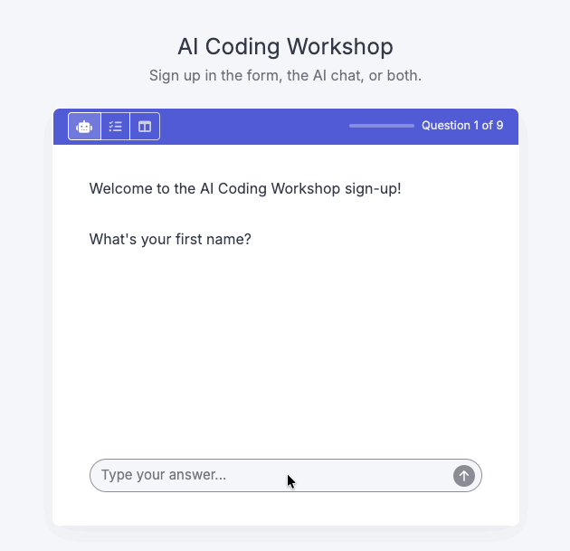

# surveychat <a href="https://dylanpieper.github.io/surveychat/"></a>

surveychat is a [shinychat](https://posit-dev.github.io/shinychat/) toolkit for conversational and adaptive surveys. Users answer in an AI chat or form. An LLM validates each answer, extracts answer data, and writes the next question or checks if it was already answered. Each answer goes to SQL tables through any DBI connection. Participants get treated in context; you get richer data.

## Installation

``` r
pak::pak("dylanpieper/surveychat")
```

## Example

A workshop sign-up that starts in the AI chat, with buttons to change to the form or to both side by side, which is useful while you test a survey. Choose the model with `chat`, as `"provider/model"`; the provider reads its own key, such as `ANTHROPIC_API_KEY`, and the model must support structured output.

``` r
surveychat::run_example("panel-chat-form", chat = "anthropic/claude-haiku-4-5")
```

<p align="center">

</p>

## Learn more

-   [Design a survey](https://dylanpieper.github.io/surveychat/articles/design-surveys.html): build and run a survey
-   [Survey data](https://dylanpieper.github.io/surveychat/articles/survey-data.html): tables, data dictionary, and supported databases
-   [A chat in a sidebar](https://dylanpieper.github.io/surveychat/articles/chat-sidebar.html): ice cream shop example, with a drawer for the answers

## Python port note

surveychat will be ported to Python to align with the R and Python codebase for shinychat.
